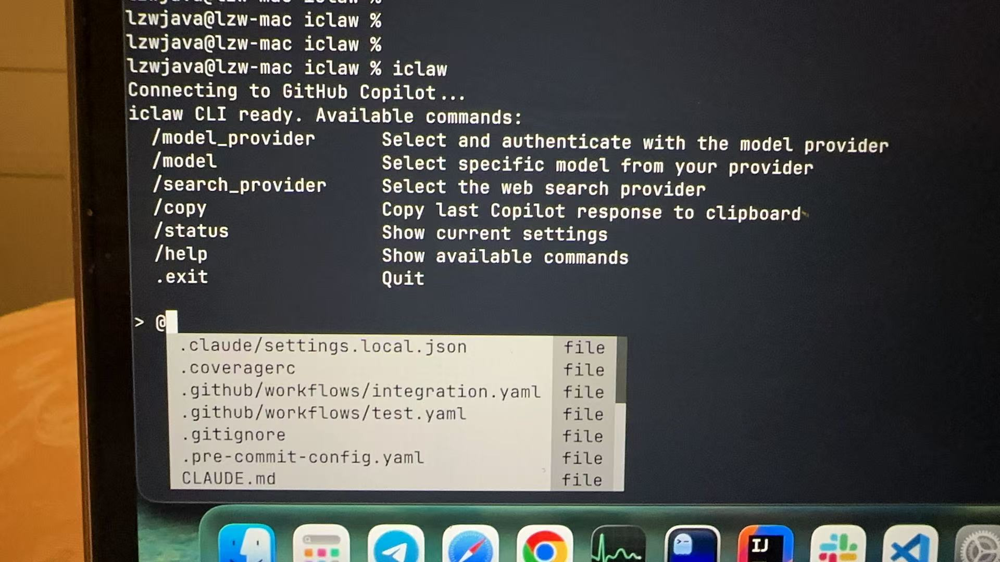
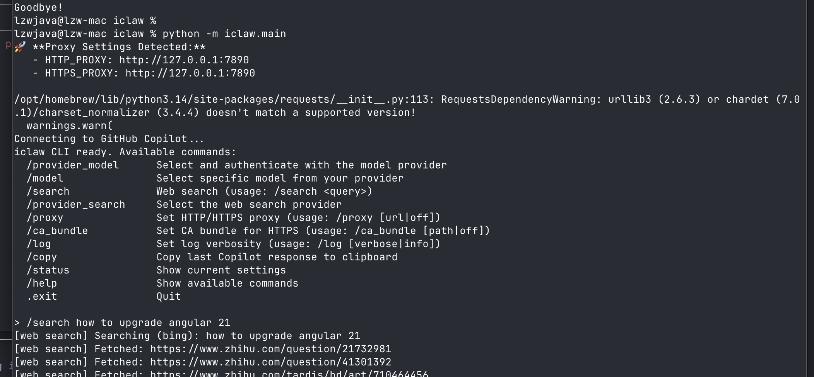

# iclaw

[中文](./README_CN.md)

A terminal AI agent that codes, searches, and runs commands for you — works on personal machines and locked-down enterprise ones.

A minimal [openclaw](https://github.com/lzwjava/openclaw) implementation, built as a plain Python CLI with no browser extensions or IDE plugins, powered by GitHub Copilot.

*Disclaimer: All tests with Copilot were performed using my personal subscription and personal account.*





## Features

- **Multi-turn conversations** with GitHub Copilot in your terminal.
- **Native Tool Calling**: The model can autonomously invoke web search, execute shell commands, and edit files.
- **Multiple Search Providers**: DuckDuckGo (default), Startpage, Bing, and Tavily.
- **GitHub OAuth device flow** authentication.
- **Automatic token refresh** during sessions.
- **Modern Default**: Uses GPT-5.2 as the default model.

## Todo

- Test iclaw in enterprise environments.
- Consult with friends at large corporations to better understand enterprise environment constraints.

## Installation

```bash
git clone https://github.com/lzwjava/iclaw
cd iclaw
pip install -e .
```

## Usage

1. **Start the REPL**:
   ```bash
   iclaw
   ```

2. **Authenticate with GitHub** (on first run):
   ```
   /provider_model
   ```
   Select `copilot`, then follow the GitHub device authorization flow. Your token is saved to `~/.config/iclaw/config.json`.

### CLI Commands
- `/provider_model`: Select and authenticate with the model provider.
- `/model`: Select specific model from your provider.
- `/search`: Web search (usage: `/search <query>`).
- `/provider_search`: Select the web search provider.
- `/proxy`: Set HTTP/HTTPS proxy (usage: `/proxy [url|off]`).
- `/ca_bundle`: Set CA bundle for HTTPS (usage: `/ca_bundle [path|off]`).
- `/log`: Set log verbosity (usage: `/log [verbose|info]`).
- `/copy`: Copy last response to clipboard.
- `/read`: Print file contents to terminal (usage: `/read <path>`).
- `/clear`: Clear conversation history.
- `/compact`: Compact conversation history using LLM.
- `/export`: Export full conversation history to JSON file.
- `/status`: Show current settings.
- `/help`: Show available commands.
- `/exit`: Quit the REPL.

## Native Tool Calling

The model has access to three tools it can invoke autonomously:

- **web_search**: Search the web for current information using your selected provider.
- **exec**: Execute shell commands with a 30-second timeout.
- **edit**: Apply unified diff patches to create or modify files.

## Search Providers

Switch providers during a session with `/provider_search`:

| Provider | API Key Required | Notes |
|----------|-----------------|-------|
| DuckDuckGo | No | Default provider |
| Startpage | No | Privacy-focused |
| Bing | No | Microsoft Bing |
| Tavily | Yes (`TAVILY_API_KEY`) | AI-native search API |

---

## Development

### Running Tests
We use `unittest` and `coverage` for testing.
```bash
python3 -m coverage run -m unittest discover tests
python3 -m coverage report -m
```

### Project Structure
```
iclaw/
├── commands/     # Modular CLI command handlers
├── tools/        # Tool implementations (edit)
├── main.py       # Core REPL loop and tool definitions
├── github_api.py # GitHub/Copilot API communication
├── web_search.py # Search providers and content extraction
├── exec_tool.py  # Shell command execution tool
└── login.py      # OAuth device flow logic

tests/            # Unit tests
integration_tests/# Network-dependent integration tests
```
